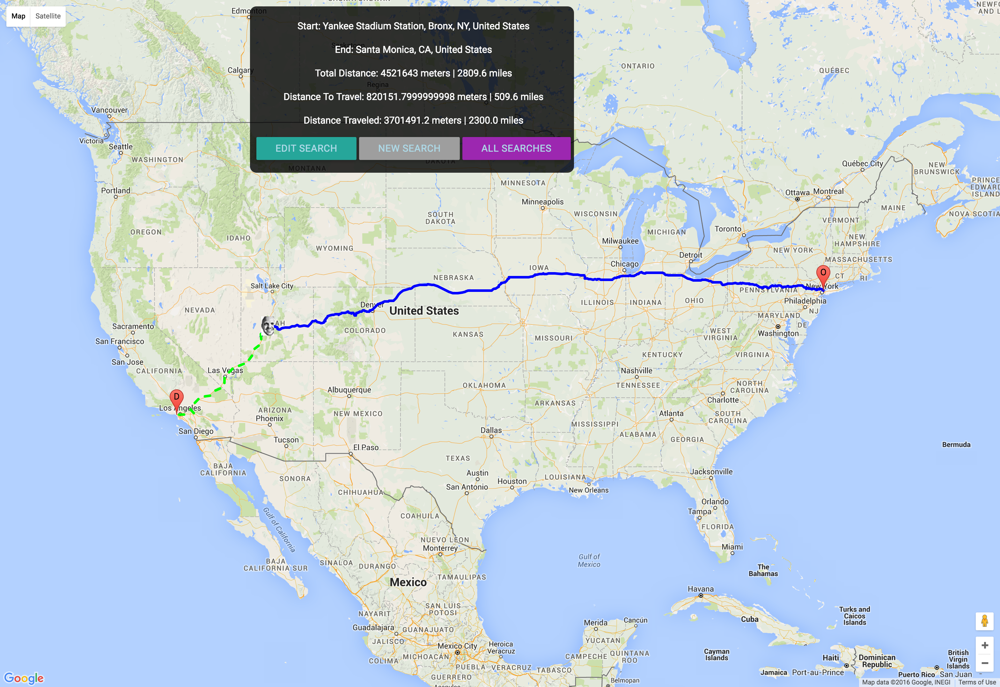

# Map-My-Route

## To Run

```
git clone
bundle install
rake db:create && rake db:migrate
rails s
````

## A Rails Map Generation App

Use the Google Maps API to draw maps with routes between two points and show progress between the points.

* Accepts two sets of coordinates (by address) and a optional Float value for the distance covered between those destinations
* Draws a map with the route between the points
* Places a marker at the position on the route representing the distance from the starting point based on the given value

* Separate lines for the route from “start” to the current point (considering the “distance covered” option) and from the current point to the finish.
* Display the numeric value of the overall distance, distance covered, and distance left.

Uses Google Maps, Geometry, Places, Autocomplete APIs


